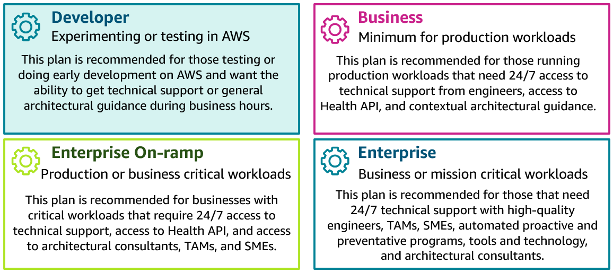
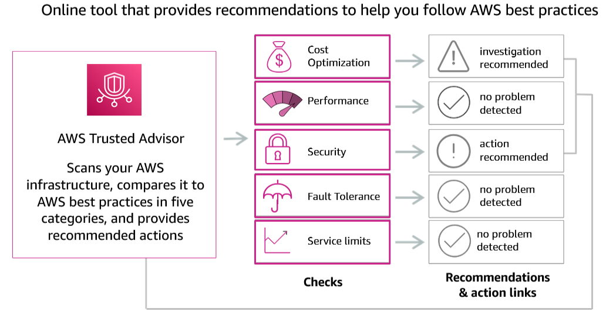
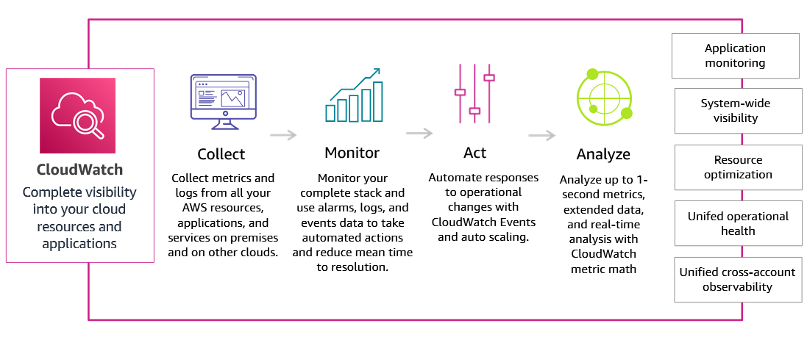
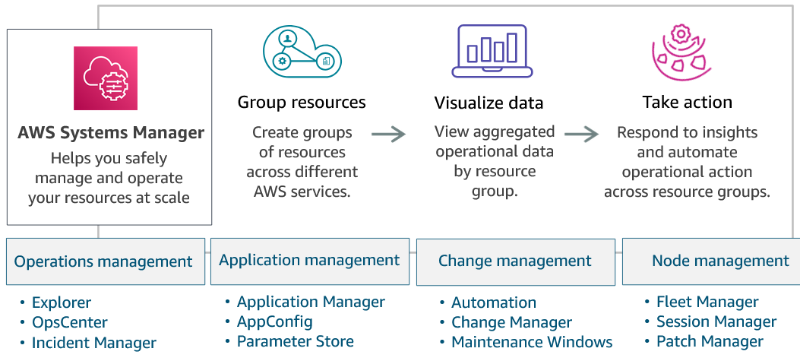
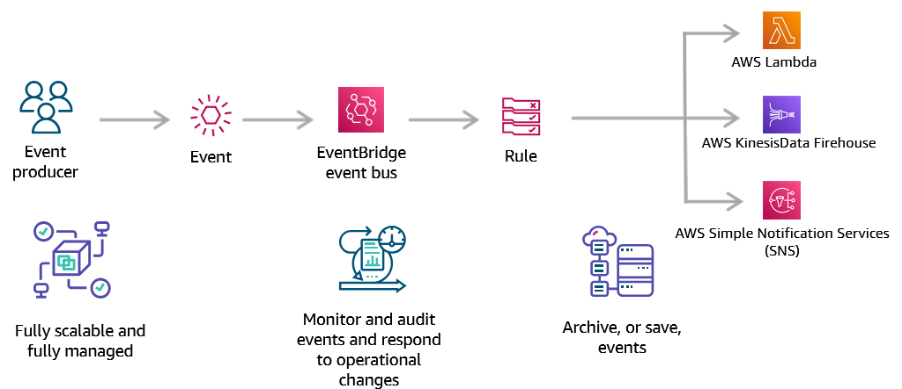
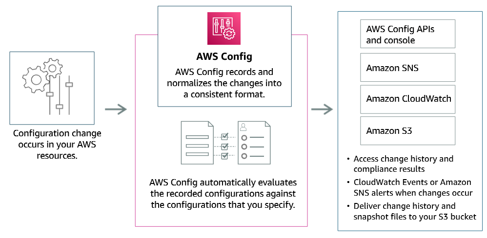
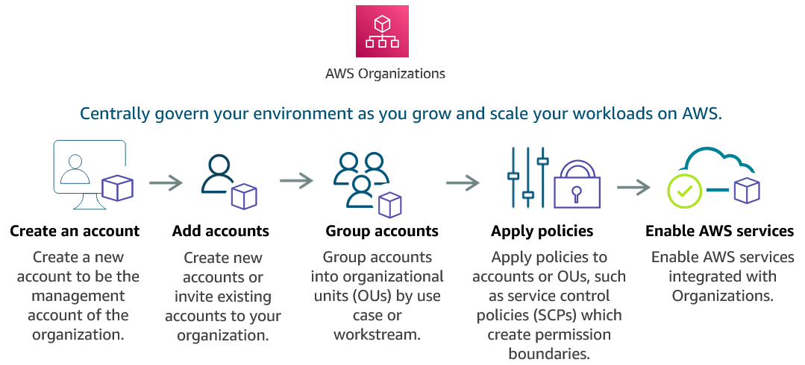

<h1 align=center> Cloud Operations </h1>

    

## Introdução ao Well-Architected Framework - Seção 1

    

### O que é o AWS Well-Architected Framework?

O AWS Well-Architected Framework é um conjunto de boas práticas e princípios de arquitetura que ajudam as organizações a projetar, construir e operar aplicações na nuvem de maneira segura, eficiente e resiliente. Ele fornece orientações sobre como otimizar cargas de trabalho em cinco áreas principais, conhecidas como pilares: Excelência Operacional, Segurança, Confiabilidade, Eficiência de Performance e Otimização de Custos. Esses pilares ajudam as empresas a alcançar seus objetivos de negócios ao mesmo tempo em que se beneficiam das vantagens da nuvem.

## Benefícios

A adoção do Cloud Operations na AWS traz uma série de benefícios estratégicos que impulsionam a eficiência e a competitividade das organizações. Aonde seus 4 principais benefícios são:

- Inovação
- Simplicidade
- Escalabilidade
- Redução de Custos

### Inovação

    

 

A AWS oferece uma vasta gama de serviços que permitem às empresas inovar rapidamente. Com acesso a tecnologias avançadas como inteligência artificial, machine learning e analytics, as organizações podem experimentar novas ideias e desenvolver soluções de ponta sem a necessidade de investimentos pesados em infraestrutura. O ambiente flexível e ágil da AWS acelera o ciclo de inovação, permitindo que as empresas se mantenham à frente no mercado.

### Simplicidade

    

 

A simplicidade operacional é um dos pilares da AWS. A plataforma fornece ferramentas e serviços que automatizam tarefas complexas de gerenciamento de infraestrutura, como monitoramento, segurança e backups. Isso reduz significativamente a carga administrativa sobre as equipes de TI, permitindo que se concentrem em iniciativas estratégicas. A interface intuitiva e a extensa documentação também facilitam a implementação e a gestão de recursos na nuvem.

### Escalabilidade

    

 

A AWS permite que as empresas escalem seus recursos de forma rápida e eficiente, de acordo com a demanda. Com a escalabilidade automática, as organizações podem ajustar sua capacidade de computação, armazenamento e rede quase em tempo real, garantindo desempenho ideal em todos os momentos. Essa flexibilidade é crucial para lidar com picos de demanda e crescimento rápido, sem comprometer a qualidade do serviço ou a experiência do usuário.

### Redução de Custos

    

 

Um dos benefícios mais atraentes do Cloud Operations na AWS é a redução de custos. A AWS opera em um modelo de pagamento conforme o uso, eliminando a necessidade de investimentos iniciais em hardware e infraestrutura. As empresas pagam apenas pelos recursos que utilizam, o que reduz o desperdício e melhora a eficiência do orçamento. Além disso, a AWS oferece diversas opções de preços e instâncias reservadas, permitindo otimizar ainda mais os custos operacionais.

---

## Pilares do Well-Architected Framework

    

 

O AWS Well-Architected Framework é um conjunto de melhores práticas e princípios de arquitetura que ajuda as organizações a construir e gerenciar aplicações seguras, eficientes, resilientes e de alto desempenho na nuvem. O framework é dividido em sete pilares fundamentais:

- Excelência Operacional
- Segurança
- Confiabilidade
- Eficiência de Performance
- Otimização de Custos
- Sustentabilidade
- Governança

### Excelência Operacional

A excelência operacional foca em como gerenciar e monitorar sistemas para entregar valor de negócio e melhorar continuamente processos e procedimentos. Isso inclui automação de tarefas, monitoramento de desempenho e implementação de práticas ágeis para assegurar a entrega contínua e a melhoria dos serviços.

### Segurança

A segurança trata de proteger informações e sistemas através da implementação de controles rigorosos para garantir a confidencialidade, integridade e disponibilidade dos dados. Isso envolve a aplicação de medidas como criptografia, gestão de identidade e acesso, e monitoramento contínuo para detectar e responder a ameaças.

### Confiabilidade

A confiabilidade se concentra em assegurar que uma carga de trabalho execute sua função pretendida corretamente e de forma consistente, inclusive em face de falhas. Isso inclui a implementação de arquiteturas resilientes, estratégias de backup e recuperação de desastres, e a capacidade de escalar para atender à demanda.

### Eficiência de Performance

A eficiência de performance trata de usar recursos de TI de maneira eficiente para atender aos requisitos do sistema. Isso envolve a escolha de tipos de instância e serviços apropriados, a otimização do uso de recursos e a monitorização do desempenho para fazer ajustes conforme necessário.

### Otimização de Custos

A otimização de custos envolve a execução de sistemas para entregar o máximo valor ao menor custo possível. Isso inclui práticas como a escolha de tipos de instância de custo-benefício, o uso de reservas e savings plans, e a implementação de ferramentas para monitorar e gerenciar custos de forma eficiente.

### Sustentabilidade

A sustentabilidade foca na minimização do impacto ambiental das operações na nuvem. Isso pode ser alcançado através da implementação de práticas como a escolha de data centers com energia renovável, a otimização do uso de recursos e a adoção de tecnologias que reduzem o consumo de energia.

### Governança

A governança envolve a implementação de controles e processos para assegurar que as políticas organizacionais sejam seguidas e que os recursos na nuvem sejam usados de maneira consistente com as melhores práticas e os requisitos regulatórios. Isso inclui a gestão de conformidade, a auditoria regular e a automação de processos de governança.

---

## Introdução ao Gerenciamento de Custos - Seção 2

    

### Modelos de Pagamento

A AWS oferece uma variedade de modelos de pagamento flexíveis que permitem às organizações otimizar custos e gerenciar seus recursos de maneira eficiente. Esses modelos são projetados para se adaptar às diferentes necessidades e usos das empresas, proporcionando maior controle sobre os gastos e permitindo uma melhor alocação de recursos.

### Pague pelo Uso (Pay-as-You-Go)

    

 

No modelo "Pague pelo Uso", você paga apenas pelos recursos que realmente utiliza, sem compromissos de longo prazo ou custos iniciais. Este modelo é ideal para cargas de trabalho variáveis ou imprevisíveis, permitindo que você ajuste a capacidade conforme a demanda e pague apenas pelo consumo efetivo.

- **Exemplos :**
    - Uma startup que desenvolve um aplicativo móvel pode usar o modelo "Pague pelo Uso" para escalar automaticamente sua infraestrutura na AWS conforme o número de usuários do aplicativo cresce pagando apenas pelo tempo e pelos recursos que são efetivamente utilizados.
    - Uma agência de marketing digital pode utilizar o modelo para lidar com campanhas sazonais durante os picos de campanha, a infraestrutura é escalada automaticamente, pagando apenas pelo uso adicional.

### Economize ao Se Comprometer (Save When You Commit)

    

 

O modelo "Economize ao Se Comprometer" permite obter descontos significativos ao reservar recursos por um período de um ou três anos. Este modelo é ideal para cargas de trabalho estáveis e previsíveis, onde você pode planejar a capacidade antecipadamente e obter economia em troca do compromisso de uso contínuo.

- **Exemplos :**
    - Uma empresa de análise de dados que precisa de uma capacidade de computação constante para processar grandes volumes de dados pode optar por Instâncias Reservadas na AWS, comprometendo-se a usar um determinado tipo de instância por um ano, em troca de um desconto significativo em comparação ao modelo de pagamento por uso.
    - Um portal de e-commerce que espera tráfego consistente ao longo do ano pode reservar instâncias para reduzir custos operacionais, as reservas garantem um preço mais baixo para a capacidade constante que será utilizada.

### Pague Menos ao Usar Mais (Pay Less When You

 Use More)

    

 

O modelo "Pague Menos ao Usar Mais" oferece preços escalonados que diminuem à medida que o consumo de recursos aumenta. Este modelo incentiva a economia de custos para cargas de trabalho de grande escala, onde os descontos são aplicados automaticamente com base no volume de uso.

- **Exemplos :**
    - Uma empresa de streaming de vídeo que armazena grandes quantidades de conteúdo em Amazon S3 pode se beneficiar do modelo "Pague Menos ao Usar Mais". À medida que o volume de armazenamento cresce, o custo por gigabyte diminui, resultando em economias significativas nos custos de armazenamento à medida que mais dados são adicionados.
    - Uma organização de pesquisa científica que processa grandes volumes de dados pode economizar em custos de computação, quanto mais recursos forem utilizados, menores serão as tarifas unitárias aplicadas.

---

## Tipos de AWS Free Tier

    

O AWS Free Tier oferece aos novos clientes a oportunidade de explorar e experimentar os serviços AWS gratuitamente por um período limitado. Existem três tipos principais de ofertas no AWS Free Tier:

### Nível Sempre Gratuito (Always Free)

Essas ofertas estão disponíveis para todos os clientes da AWS e não expiram. Elas incluem serviços como o AWS Lambda, com um milhão de solicitações gratuitas por mês, e o Amazon DynamoDB, com 25 GB de armazenamento gratuito.

### Nível de 12 Meses (12 Months Free)

Essas ofertas são válidas por 12 meses a partir da data de registro na AWS. Incluem serviços como o Amazon EC2, com 750 horas de uso gratuito por mês de instâncias t2.micro, e o Amazon S3, com 5 GB de armazenamento gratuito.

### Ofertas de Teste (Trials)

Essas ofertas permitem que os clientes experimentem novos serviços por um curto período, geralmente de 30 a 60 dias. Um exemplo é o Amazon Redshift, que oferece 750 horas de uso gratuito de nós DC2.Large por 2 meses.

---

## Ferramentas para Melhorar a Redução de Custos

### AWS Pricing Calculator

    

 

O AWS Pricing Calculator é uma ferramenta que permite estimar os custos dos serviços AWS com base em suas necessidades específicas. Você pode configurar e comparar diferentes cenários de uso, ajustando parâmetros como capacidade de computação, armazenamento e transferência de dados para obter uma estimativa detalhada dos custos.

- **Exemplos :**
    - Um arquiteto de soluções pode usar o AWS Pricing Calculator para prever os custos mensais de um novo projeto de migração para a nuvem, garantindo que o orçamento esteja alinhado com as expectativas da empresa.
    - Uma empresa pode comparar diferentes configurações de instâncias EC2 para encontrar a opção mais econômica ajustando recursos como CPU, memória e armazenamento para otimizar custos.

### AWS Budgets

    

 

O AWS Budgets é uma ferramenta poderosa que permite definir orçamentos personalizados para monitorar os custos e o uso dos serviços AWS. Com o AWS Budgets, você pode criar alertas para ser notificado quando seus custos ou uso estiverem se aproximando dos limites definidos, garantindo que você mantenha o controle sobre seus gastos na nuvem.

- **Funcionalidades**
    - **Definição de Orçamentos:** Crie orçamentos detalhados para serviços específicos, grupos de recursos, ou para toda a sua conta AWS.
    - **Alertas Personalizados:** Configure alertas via e-mail ou SMS para ser notificado quando seus custos ou uso estiverem prestes a exceder os limites definidos.
    - **Monitoramento de Uso e Custos:** Acompanhe em tempo real o uso e os custos dos serviços AWS, com visualizações gráficas e relatórios detalhados.
    - **Integração com AWS Cost Explorer:** Utilize o AWS Cost Explorer para visualizar e analisar os dados de custos e uso associados aos seus orçamentos.

- **Exemplos :**
    - Uma startup pode usar o AWS Budgets para definir um orçamento mensal para os serviços de computação e armazenamento, com alertas configurados, a equipe financeira será notificada se os custos se aproximarem do limite estabelecido.
    - Uma grande corporação pode monitorar os custos de vários projetos simultaneamente, garantindo que cada projeto mantenha-se dentro do orçamento alocado.

### AWS Cost Explorer

    

 

O AWS Cost Explorer é uma ferramenta que permite visualizar, entender e gerenciar seus custos e uso da AWS ao longo do tempo. Ele fornece gráficos interativos e relatórios detalhados que ajudam a identificar padrões de gasto, otimizar custos e planejar futuros investimentos.

- **Exemplos :**
    - Um gerente financeiro pode usar o AWS Cost Explorer para analisar os gastos mensais da empresa com serviços AWS, identificando áreas de otimização e tomando decisões informadas sobre a alocação de recursos.
    - Uma equipe de DevOps pode utilizar a ferramenta para monitorar os custos de ambientes de desenvolvimento e produção, comparando e ajustando conforme necessário para manter os custos sob controle.

### AWS Migration Evaluator

    

 

O AWS Migration Evaluator (anteriormente TSO Logic) é uma ferramenta que ajuda as organizações a avaliar os custos e os benefícios da migração para a AWS. Ele analisa os dados do ambiente atual e fornece um relatório detalhado com recomendações de migração, ajudando a tomar decisões informadas sobre a transição para a nuvem.

- **Exemplos :**
    - Uma empresa pode usar o AWS Migration Evaluator para entender os custos envolvidos na migração de sua infraestrutura on-premises para a AWS desenvolvendo um plano de migração que maximize a eficiência e a economia de custos.
    - Uma organização sem fins lucrativos pode avaliar os benefícios de migrar suas operações para a AWS identificando oportunidades para reduzir custos operacionais e melhorar a eficiência.

---

## Gerenciando sua Conta na AWS - Seção 3

### AWS Support Plans

    

 

A AWS oferece quatro tipos de planos de suporte que permitem que você escolha o nível de suporte mais adequado às necessidades do seu negócio:

### Basic Support

Inclui acesso 24x7 ao atendimento ao cliente para questões de faturamento e acesso à documentação e fóruns da AWS.

- **Exemplos:**
    - Uma pequena startup pode usar o Basic Support para obter ajuda com questões de faturamento e orientações iniciais sobre o uso dos serviços AWS.
    - Um desenvolvedor individual pode usar o Basic Support para acessar tutoriais e documentações técnicas.

### Developer Support

Fornece suporte técnico durante o horário comercial com tempos de resposta garantidos e acesso a especialistas em arquitetura para orientação.

- **Exemplos:**
    - Uma equipe de desenvolvimento pode usar o Developer Support para obter assistência técnica em horário comercial durante a construção de um novo aplicativo.
    - Uma empresa de software pode usar o Developer Support para resolver problemas técnicos que surgem durante a fase de desenvolvimento.

### Business Support

Oferece suporte 24x7 com tempos de resposta mais rápidos, acesso a arquitetos de soluções e uma análise de uso mensal.

- **Exemplos:**
    - Uma empresa de comércio eletrônico pode usar o Business Support para garantir suporte contínuo e respostas rápidas a problemas críticos que afetam suas operações.
    - Uma empresa de mídia pode usar o Business Support para obter análises mensais detalhadas do uso e otimização de seus recursos na AWS.

### Enterprise Support

Inclui todos os benefícios do Business Support, além de um gerente técnico de conta designado, suporte proativo e treinamento exclusivo.

- **Exemplos:** 
    - Uma grande corporação pode usar o Enterprise Support para receber suporte personalizado e proativo, garantindo que suas operações críticas na AWS sejam otimizadas e protegidas.
    - Uma organização global pode usar o Enterprise Support para ter um gerente técnico de conta dedicado, ajudando a planejar e implementar estratégias de nuvem complexas.

---

### AWS Tags

    

 

As tags na AWS são rótulos que você pode atribuir aos seus recursos da AWS para organizar e gerenciar melhor esses recursos.

- **Benefícios**
    - **Organização de Recursos:** As tags permitem agrupar recursos por projeto, ambiente ou proprietário, facilitando a organização e a navegação.
    - **Alocação de Custos:** As tags ajudam a rastrear e atribuir custos aos centros de custo apropriados, melhorando a visibilidade financeira.
    - **Automação:** As tags podem ser usadas para automatizar processos, como o desligamento de instâncias não utilizadas fora do horário comercial.
    - **Controle de Acesso:** As tags permitem aplicar políticas de segurança baseadas em rótulos, garantindo que apenas usuários autorizados possam acessar determinados recursos.

### AWS Trusted Advisor

    

 

O AWS Trusted Advisor é uma ferramenta que oferece recomendações em tempo real para ajudar a otimizar sua infraestrutura AWS em cinco áreas principais: Custos, Desempenho, Segurança, Tolerância a Falhas e Limites de Serviço. O Trusted Advisor verifica automaticamente seus recursos e fornece relatórios detalhados com sugestões de melhoria, ajudando a garantir que você esteja seguindo as melhores práticas da AWS.

- **Benefícios**
    - **Otimização de Custos:**
    - **Performance:**
    - **Segurança:**
    - **Tolerança a Falhas:**
    - **Cotas de Serviços:**

## Serviços adicionais na nuvem AWS - Seção 4

### AWS CloudWatch

    

 

O AWS CloudWatch é um serviço de monitoramento e observabilidade que proporciona dados e insights acionáveis para monitorar suas aplicações, responder sistematicamente a mudanças de desempenho e otimizar a utilização de recursos. Com o CloudWatch, você pode coletar e acompanhar métricas, coletar e monitorar arquivos de log, definir alarmes e automatizar ações com base em seus dados.

- **Benefícios**
    - **Auditoria de Atividades:** Permite o rastreamento de atividades de usuários e recursos em sua infraestrutura AWS, garantindo conformidade e segurança.
        - **Exemplos:**
            - Monitorar o uso de recursos para garantir que todos os serviços estejam em conformidade com as políticas da empresa.
            - Identificar padrões de acesso e uso para auditorias internas e externas.

    - **Identificar falhas de Segurança:** Acompanhamento de eventos de segurança em tempo real para detectar e responder a possíveis ameaças rapidamente.
        - **Exemplos:**
            - Configurar alarmes para atividades suspeitas, como tentativas de login falhadas.
            - Monitorar logs de segurança para identificar e mitigar vulnerabilidades.

    - **Encontrar falhas operacionais:** Ajuda a identificar problemas de desempenho e falhas operacionais em suas aplicações e infraestrutura.
        - **Exemplos:**
            - Definir alarmes para métricas de desempenho, como uso de CPU ou latência de rede, para detectar problemas antes que afetem os usuários.
            - Coletar logs de aplicação para análise de erros e falhas.

---

### AWS Systems Manager

    

 

O AWS Systems Manager é uma ferramenta que fornece uma interface unificada para gerenciar sua infraestrutura na AWS. Ele permite automatizar tarefas administrativas, coletar dados de inventário, aplicar patches automaticamente e configurar sistemas operacionais e aplicações.

- **Benefícios**
    - **Gerenciamento Centralizado:** Proporciona um ponto centralizado para gerenciar e visualizar seus recursos AWS, simplificando a administração.
        - **Exemplos:**
            - Gerenciar configurações de instâncias EC2 e outros recursos a partir de um único console.
            - Automatizar tarefas recorrentes, como atualização de pacotes e aplicação de patches.

    - **Automação de Tarefas:** Permite automatizar tarefas operacionais e de manutenção, reduzindo a carga de trabalho manual.
        - **Exemplos:**
            - Configurar scripts para executar verificações de saúde e backups automáticos.
            - Automatizar a aplicação de patches de segurança em sistemas operacionais.

    - **Visibilidade de Inventário:** Coleta dados detalhados de inventário sobre seus recursos e software, ajudando na gestão e conformidade.
        - **Exemplos:**
            - Monitorar versões de software e patches aplicados em todos os servidores.
            - Obter relatórios de inventário para auditorias de conformidade.

---

### AWS EventBridge

    

 

O AWS EventBridge é um serviço que facilita a criação de aplicações orientadas a eventos, conectando dados de suas próprias aplicações com serviços AWS e aplicações de software como serviço (SaaS). Ele permite configurar roteamento de eventos em tempo real, simplificando a construção de aplicações reativas.

- **Benefícios**
    - **Integração Simplificada:** Conecta diferentes serviços AWS e aplicações SaaS com facilidade, permitindo a construção de fluxos de trabalho complexos.
        - **Exemplos:**
            - Configurar eventos que disparem funções Lambda para processar dados em tempo real.
            - Integrar com serviços SaaS para automatizar fluxos de trabalho de negócios.

    - **Roteamento de Eventos:** Permite definir regras para roteamento de eventos com base em padrões específicos, garantindo que os dados sejam direcionados para os destinos corretos.
        - **Exemplos:**
            - Criar regras para roteamento de eventos de mudanças de estado em aplicações.
            - Direcionar eventos para diferentes destinos com base em padrões de conteúdo.

---

### AWS Config

    

 

O AWS Config é um serviço que permite avaliar, auditar e avaliar as configurações de seus recursos AWS. Ele monitora e registra continuamente as configurações de seus recursos AWS e permite automatizar a avaliação de configurações gravadas contra as configurações desejadas.

- **Benefícios**
    - **Monitoramento Contínuo:** Rastreia e registra continuamente as configurações dos recursos, garantindo que todas as mudanças sejam documentadas.
        - **Exemplos:**
            - Manter um histórico detalhado de todas as mudanças de configuração para fins de auditoria.
            - Receber alertas quando as configurações dos recursos divergem das políticas definidas.

    - **Conformidade Automática:** Automatiza a avaliação da conformidade de recursos com suas políticas internas, ajudando a garantir a conformidade regulatória.
        - **Exemplos:**
            - Implementar regras de conformidade para garantir que todos os recursos estejam configurados de acordo com as melhores práticas.
            - Automatizar a correção de recursos não conformes com políticas de segurança.

---

### AWS Organizations

    

 

O AWS Organizations é um serviço que oferece uma maneira centralizada para gerenciar e consolidar várias contas AWS. Ele permite automatizar processos de criação de contas, gerenciar permissões e aplicar políticas de governança em todas as contas de sua organização.

- **Benefícios**
    - **Gerenciamento Centralizado:** Facilita o gerenciamento de várias contas AWS a partir de um único ponto, simplificando a administração e a governança.
        - **Exemplos:**
            - Consolidar a faturação de várias contas para simplificar o gerenciamento de custos.
            - Aplicar políticas de segurança e conformidade de maneira centralizada em todas as contas.

    - **Aplicação de Políticas:** Permite definir e aplicar políticas de controle de serviços e segurança em todas as contas, garantindo uma governança consistente.
        - **Exemplos:**
            - Criar políticas de serviço que restrinjam o uso de certos serviços AWS a apenas contas específicas.
            - Implementar políticas de segurança que se apliquem automaticamente a todas as novas contas criadas.

    - **Automação de Contas:** Automatiza a criação e configuração de novas contas, permitindo escalabilidade e padronização.
        - **Exemplos:**
            - Usar modelos para configurar automaticamente novas contas com permissões e configurações predefinidas.
            - Automatizar a integração de novas contas com ferramentas de monitoramento e segurança.