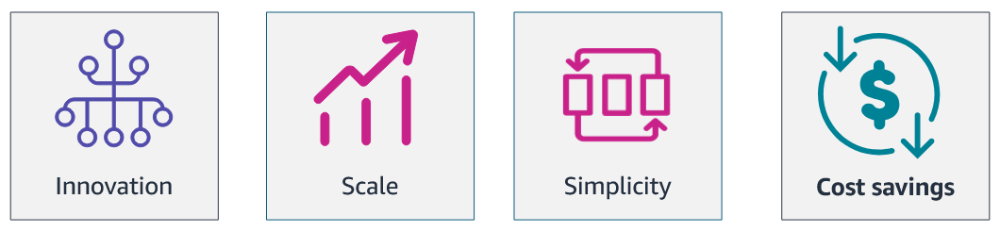

<h1 align=center> Cloud Operations </h1>

    

## Introdução ao Well-Architected Framework

    

### O que é o AWS Well-Architected Framework?

O AWS Well-Architected Framework é um conjunto de boas práticas e princípios de arquitetura que ajudam as organizações a projetar, construir e operar aplicações na nuvem de maneira segura, eficiente e resiliente. Ele fornece orientações sobre como otimizar cargas de trabalho em cinco áreas principais, conhecidas como pilares: Excelência Operacional, Segurança, Confiabilidade, Eficiência de Performance e Otimização de Custos. Esses pilares ajudam as empresas a alcançar seus objetivos de negócios ao mesmo tempo em que se beneficiam das vantagens da nuvem.

### Benefícios

A adoção do Cloud Operations na AWS traz uma série de benefícios estratégicos que impulsionam a eficiência e a competitividade das organizações. Aonde seus 4 principais benefícios são:

- Inovação
- Simplicidade
- Escalabilidade
- Redução de Custos

### Inovação

    

 

A AWS oferece uma vasta gama de serviços que permitem às empresas inovar rapidamente. Com acesso a tecnologias avançadas como inteligência artificial, machine learning e analytics, as organizações podem experimentar novas ideias e desenvolver soluções de ponta sem a necessidade de investimentos pesados em infraestrutura. O ambiente flexível e ágil da AWS acelera o ciclo de inovação, permitindo que as empresas se mantenham à frente no mercado.

### Simplicidade

    

 

A simplicidade operacional é um dos pilares da AWS. A plataforma fornece ferramentas e serviços que automatizam tarefas complexas de gerenciamento de infraestrutura, como monitoramento, segurança e backups. Isso reduz significativamente a carga administrativa sobre as equipes de TI, permitindo que se concentrem em iniciativas estratégicas. A interface intuitiva e a extensa documentação também facilitam a implementação e a gestão de recursos na nuvem.

### Escalabilidade

    

 

A AWS permite que as empresas escalem seus recursos de forma rápida e eficiente, de acordo com a demanda. Com a escalabilidade automática, as organizações podem ajustar sua capacidade de computação, armazenamento e rede quase em tempo real, garantindo desempenho ideal em todos os momentos. Essa flexibilidade é crucial para lidar com picos de demanda e crescimento rápido, sem comprometer a qualidade do serviço ou a experiência do usuário.

### Redução de Custos

    

 

Um dos benefícios mais atraentes do Cloud Operations na AWS é a redução de custos. A AWS opera em um modelo de pagamento conforme o uso, eliminando a necessidade de investimentos iniciais em hardware e infraestrutura. As empresas pagam apenas pelos recursos que utilizam, o que reduz o desperdício e melhora a eficiência do orçamento. Além disso, a AWS oferece diversas opções de preços e instâncias reservadas, permitindo otimizar ainda mais os custos operacionais.

---

## Pilares do Well-Architected Framework

    

O AWS Well-Architected Framework é um conjunto de melhores práticas e princípios de arquitetura que ajuda as organizações a construir e gerenciar aplicações seguras, eficientes, resilientes e de alto desempenho na nuvem. O framework é dividido em sete pilares fundamentais:

- Excelência Operacional
- Segurança
- Confiabilidade
- Eficiência de Performance
- Otimização de Custos
- Sustentabilidade
- Governança

### Excelência Operacional

A excelência operacional foca em como gerenciar e monitorar sistemas para entregar valor de negócio e melhorar continuamente processos e procedimentos. Isso inclui automação de tarefas, monitoramento de desempenho e implementação de práticas ágeis para assegurar a entrega contínua e a melhoria dos serviços.

### Segurança

A segurança trata de proteger informações e sistemas através da implementação de controles rigorosos para garantir a confidencialidade, integridade e disponibilidade dos dados. Isso envolve a aplicação de medidas como criptografia, gestão de identidade e acesso, e monitoramento contínuo para detectar e responder a ameaças.

### Confiabilidade

A confiabilidade se concentra em assegurar que uma carga de trabalho execute sua função pretendida corretamente e de forma consistente, inclusive em face de falhas. Isso inclui a implementação de arquiteturas resilientes, estratégias de backup e recuperação de desastres, e a capacidade de escalar para atender à demanda.

### Eficiência de Performance

A eficiência de performance trata de usar recursos de TI de maneira eficiente para atender aos requisitos do sistema. Isso envolve a escolha de tipos de instância e serviços apropriados, a otimização do uso de recursos e a monitorização do desempenho para fazer ajustes conforme necessário.

### Otimização de Custos

A otimização de custos envolve a execução de sistemas para entregar o máximo valor ao menor custo possível. Isso inclui práticas como a escolha de tipos de instância de custo-benefício, o uso de reservas e savings plans, e a implementação de ferramentas para monitorar e gerenciar custos de forma eficiente.

### Sustentabilidade

A sustentabilidade foca na minimização do impacto ambiental das operações na nuvem. Isso pode ser alcançado através da implementação de práticas como a escolha de data centers com energia renovável, a otimização do uso de recursos e a adoção de tecnologias que reduzem o consumo de energia.

### Governança

A governança envolve a implementação de controles e processos para assegurar que as políticas organizacionais sejam seguidas e que os recursos na nuvem sejam usados de maneira consistente com as melhores práticas e os requisitos regulatórios. Isso inclui a gestão de conformidade, a auditoria regular e a automação de processos de governança.

---

## Introdução ao Gerenciamento de Custos

    

### Modelos de Pagamento

A AWS oferece uma variedade de modelos de pagamento flexíveis que permitem às organizações otimizar custos e gerenciar seus recursos de maneira eficiente. Esses modelos são projetados para se adaptar às diferentes necessidades e usos das empresas, proporcionando maior controle sobre os gastos e permitindo uma melhor alocação de recursos.

### Pague pelo Uso (Pay-as-You-Go)

    

No modelo "Pague pelo Uso", você paga apenas pelos recursos que realmente utiliza, sem compromissos de longo prazo ou custos iniciais. Este modelo é ideal para cargas de trabalho variáveis ou imprevisíveis, permitindo que você ajuste a capacidade conforme a demanda e pague apenas pelo consumo efetivo.

**Exemplo:** Uma startup que desenvolve um aplicativo móvel pode usar o modelo "Pague pelo Uso" para escalar automaticamente sua infraestrutura na AWS conforme o número de usuários do aplicativo cresce, pagando apenas pelo tempo e pelos recursos que são efetivamente utilizados.

### Economize ao Se Comprometer (Save When You Commit)

    

O modelo "Economize ao Se Comprometer" permite obter descontos significativos ao reservar recursos por um período de um ou três anos. Este modelo é ideal para cargas de trabalho estáveis e previsíveis, onde você pode planejar a capacidade antecipadamente e obter economia em troca do compromisso de uso contínuo.

**Exemplo:** Uma empresa de análise de dados que precisa de uma capacidade de computação constante para processar grandes volumes de dados pode optar por Instâncias Reservadas na AWS, comprometendo-se a usar um determinado tipo de instância por um ano, em troca de um desconto significativo em comparação ao modelo de pagamento por uso.

### Pague Menos ao Usar Mais (Pay Less When You Use More)

    

O modelo "Pague Menos ao Usar Mais" oferece preços escalonados que diminuem à medida que o consumo de recursos aumenta. Este modelo incentiva a economia de custos para cargas de trabalho de grande escala, onde os descontos são aplicados automaticamente com base no volume de uso.

**Exemplo:** Uma empresa de streaming de vídeo que armazena grandes quantidades de conteúdo em Amazon S3 pode se beneficiar do modelo "Pague Menos ao Usar Mais". À medida que o volume de armazenamento cresce, o custo por gigabyte diminui, resultando em economias significativas nos custos de armazenamento à medida que mais dados são adicionados.