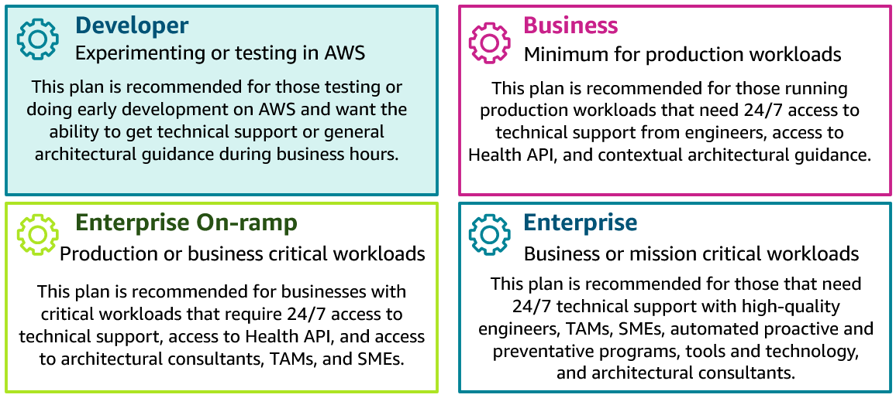
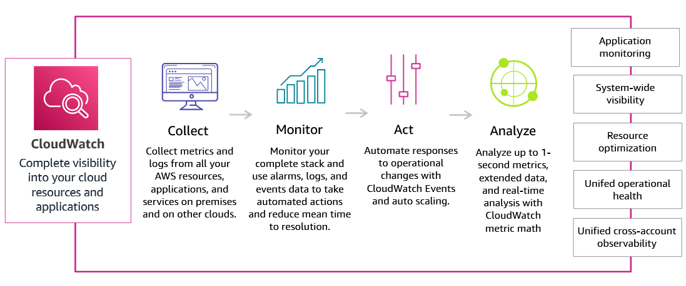

<h1 align=center> Security </h1>

    

## Introdução a Segurança - Seção 1

    

---

## Introdução ao AWS IAM - Seção 2

    

### Multi Factor Authentication (MFA)

### IAM Identity Center

    

### Custos do AWS IAM

---

## Usando o AWS IAM - Seção 3

### Formas de Usar o AWS IAM

- Console
- Command Line Interface (CLI)
- Software Development Kit (SDK)

### AWS Support Plans

    

---

## Serviços de Segurança Adicionais da AWS - Seção 4

### AWS CloudWatch

    

