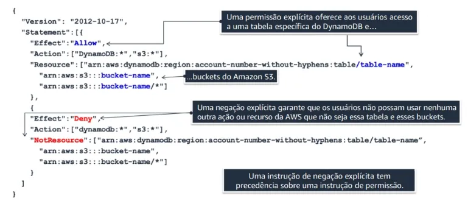

<h1 align="center">AWS Identity and Access Management (IAM)</h1>

<div align="center">
    
</div>

---

## 1. Introdução

O **AWS Identity and Access Management (IAM)** é um serviço da Web que ajuda você a **controlar o acesso** aos recursos da AWS de forma segura. Com o IAM, é possível **gerenciar centralizadamente** permissões que definem quais recursos da AWS cada usuário poderá acessar. Assim, você controla quem está autenticado (login) e autorizado (permissões) a usar os recursos da nuvem.

---

## 2. Tipos de Políticas do IAM

No IAM, as **políticas** são documentos JSON que definem permissões. Elas podem ser anexadas a identidades (como usuários, grupos e funções) ou a recursos (como buckets do S3). Abaixo, apresentamos os dois principais tipos de políticas:

### 2.1 Políticas Baseadas em Identidade

As políticas baseadas em identidade são anexadas a um **principal** (ou identidade), como um usuário, um grupo ou uma função. Elas controlam **quais ações** essa identidade pode executar e **em quais recursos**.

- **2.1.1 Políticas Gerenciadas**  
  São políticas **independentes** que podem ser anexadas a **vários** usuários, grupos e funções na sua conta da AWS. Podem ser:
  - **Gerenciadas pela AWS**: criadas e atualizadas pela própria AWS para casos de uso comuns, como acesso ao S3.
  - **Gerenciadas pelo Cliente**: criadas e mantidas por você, permitindo flexibilidade total na definição de permissões.

- **2.1.2 Políticas Em Linha**  
  São políticas **embutidas diretamente** em um único usuário, grupo ou função.  
  - **Escopo restrito**: usadas em cenários muito específicos, pois **não podem** ser reutilizadas em outras identidades.
  - **Gerenciamento isolado**: todas as alterações ocorrem na entidade em que a política está embutida.

#### Observação sobre Boas Práticas
- Ao precisar anexar a mesma política a vários usuários do IAM, é mais prático colocá-los em **um grupo** e anexar a política ao grupo, em vez de replicar a política em cada usuário.

---

### 2.2 Políticas Baseadas em Recursos

São anexadas **diretamente** a um recurso (por exemplo, um bucket do Amazon S3 ou uma fila do SQS). Essas políticas definem **quem** (identidades ou contas externas) pode executar ações naquele recurso em particular e **em quais condições**.

- **Exemplo de Política Baseada em Recursos (DynamoDB + S3)**

  <div align="center">
      
  </div>

  Nesta política de exemplo (em formato JSON), a entidade principal obtém acesso **somente** aos recursos listados:
  
  - A tabela do Amazon DynamoDB chamada `table-name`.
  - O bucket do Amazon S3 chamado `bucket-name` e todos os objetos nele contidos.

  Além disso, há um elemento `"Effect": "Deny"` com `NotResource`, que **nega explicitamente** qualquer outra ação ou recurso que não esteja declarado como permitido. Essa **negação explícita** tem precedência sobre qualquer permissão concedida em outra política.

---

## 3. Usuários IAM

Os **usuários IAM** são entidades que você cria para representar pessoas ou serviços que interagem com a AWS. Cada usuário possui credenciais (como **usuário e senha** ou **chaves de acesso**), e você pode atribuir **políticas** para definir o que cada usuário pode ou não fazer.  

---

## 4. Grupos IAM

Os **grupos IAM** servem para **agrupar usuários** com necessidades de permissão semelhantes, facilitando o gerenciamento:
- Exemplos:
  - **Admins**: permissões administrativas completas.
  - **Developers**: permissões de desenvolvimento mais limitadas.
- Ao adicionar um usuário a um grupo, ele **herda** automaticamente as permissões do grupo.

---

## 5. Permissões IAM

As permissões no IAM são concedidas por meio de **políticas**. Abaixo, um exemplo de política de permissão para um bucket S3:

```json
{
    "Version": "2012-10-17",
    "Statement": [
        {
            "Effect": "Allow",
            "Action": [
                "s3:PutObject",
                "s3:GetObject",
                "s3:DeleteObject"
            ],
            "Resource": "arn:aws:s3:::my_bucket/*"
        }
    ]
}
```

- `s3:PutObject` - Criação  
- `s3:GetObject` - Leitura  
- `s3:DeleteObject` - Remoção  

> **Observação:** o `/*` no final do ARN do recurso significa que a política se aplica a todos os objetos do bucket.

---

## 6. Multi-Factor Authentication (MFA)

O **MFA** (Multi-Factor Authentication) adiciona uma camada extra de segurança ao exigir dois ou mais fatores para autenticação:
- **Algo que você sabe** (senha, PIN);
- **Algo que você tem** (dispositivo físico, app de autenticação);
- **Algo que você é** (impressão digital, reconhecimento facial).

**Benefícios:**
- Maior proteção contra ataques de phishing e força bruta.
- Atendimento a requisitos de conformidade.
- Pode ser exigido para ações críticas (como exclusões de recursos).

---

## 7. Funções IAM

As **funções IAM** delegam permissões a serviços da AWS ou contas externas, permitindo que eles executem ações **em seu nome** sem precisar expor credenciais permanentes.

- **Casos de Uso:**
  - AWS Lambda: execução de código sem inserir chaves de acesso.
  - Conexões entre contas (AssumeRole).
  - Serviços de terceiros, usando **External ID** para controle adicional.

**Exemplo de Política para Função IAM:**
```json
{
    "Version": "2012-10-17",
    "Statement": [
        {
            "Effect": "Allow",
            "Action": "ec2:DescribeInstances",
            "Resource": "*"
        }
    ]
}
```

---

## 8. IAM Access Analyzer

O **IAM Access Analyzer** verifica suas políticas e identifica se algum recurso da AWS está exposto publicamente ou a entidades externas.  
- Detecção de buckets S3 públicos.
- Análise de permissões em contas cruzadas.

---

## 9. Práticas Recomendadas de Segurança

1. **Princípio do Menor Privilégio**: conceda apenas as permissões necessárias.  
2. **Habilite o MFA**: especialmente para a conta raiz e usuários críticos.  
3. **Audite permissões**: use ferramentas como **Access Advisor** para remover acessos não utilizados.  
4. **Use Funções Temporárias**: em vez de credenciais de longa duração.  
5. **Políticas de Senha Rígidas**: defina complexidade, rotação e histórico.  
6. **Monitore as Atividades**: integre o IAM ao AWS CloudTrail para rastrear ações críticas.

---

## 10. Logs e Monitoramento com CloudTrail

O **AWS CloudTrail** registra chamadas de API e eventos, permitindo:  
- **Rastreamento de Alterações**: descubra quem alterou políticas ou removeu recursos.  
- **Auditoria**: atenda a requisitos de conformidade como ISO 27001 e PCI-DSS.  
- **Alertas**: integre com CloudWatch para disparar notificações diante de atividades suspeitas.

---

## 11. Integração com Serviços de Diretório

Use o **AWS Directory Service** ou **AWS Single Sign-On (SSO)** para autenticação centralizada:  
- **AD Connector**: sincronize usuários e grupos do Active Directory (AD) com o IAM.  
- **AWS SSO**: gerencie acesso a múltiplas contas AWS e aplicativos de terceiros em um só lugar.

---

## 12. Senhas e Políticas de Acesso

O IAM permite configurar **políticas de senha** com requisitos como:  
- Complexidade (letras maiúsculas, minúsculas, números, símbolos).  
- Tamanho mínimo.  
- Rotação obrigatória após X dias.  
- Bloqueio de reuso de senhas recentes.

---

## 13. AWS Security Token Service (STS)

O **STS** gera credenciais temporárias para acesso a recursos:
- Substitui o uso de chaves de longo prazo.
- Frequente em cenários de **AssumeRole** para contas cruzadas ou sistemas externos.

---

## 14. Service Control Policies (SCP) com AWS Organizations

As **SCPs** impõem restrições de segurança a **todas** as contas de uma organização:
- Restringir criação de recursos em certas regiões.
- Bloquear uso de serviços específicos.
- Funciona em conjunto com as políticas do IAM em cada conta.

---

## 15. Curiosidades

- **Multi-Conta**: o IAM se integra com o **AWS Organizations** para gerenciamento centralizado.  
- **Data de Lançamento**: IAM foi introduzido em **2010**, sendo um dos pilares da segurança na AWS.  
- **Escopo de Ações**: são **centenas** de ações documentadas que você pode controlar em políticas JSON.  
- **Conformidade**: essencial para cumprir GDPR, HIPAA, ISO 27001, PCI-DSS, entre outros.

---

## 16. Conclusão

O IAM é o **pilar da segurança** na AWS, fornecendo gerenciamento granular e escalável de permissões. Dominar seu uso é fundamental para **proteger aplicações**, **cumprir requisitos de conformidade** e **evitar acessos indevidos**. Compreender **usuários**, **grupos**, **funções**, **políticas** e as ferramentas de auditoria é a base para qualquer ambiente seguro na nuvem AWS.

---

## 17. Links e Referências

Para aprofundar seu conhecimento sobre o **AWS IAM**, consulte os seguintes recursos oficiais e complementares:

- [**Documentação Oficial do AWS IAM**](https://docs.aws.amazon.com/pt_br/IAM/latest/UserGuide/introduction.html)  
- [**Boas Práticas de Segurança com IAM**](https://docs.aws.amazon.com/pt_br/IAM/latest/UserGuide/best-practices.html)  
- [**Guia de Início Rápido do AWS IAM**](https://aws.amazon.com/pt/iam/getting-started/)  
- [**AWS IAM Blog**](https://aws.amazon.com/blogs/security/category/security/identity-and-access-management/)  
- [**Tutoriais e Workshops do AWS IAM**](https://aws.amazon.com/training/paths-security/)  
- [**Whitepapers de Segurança da AWS**](https://aws.amazon.com/whitepapers/?awsf.filter-content-type=*all&awsf.filter-security=*all)  
  - [**AWS Security Best Practices**](https://d1.awsstatic.com/whitepapers/Security/AWS_Security_Best_Practices.pdf)  
- [**AWS re:Invent Sessions sobre IAM**](https://reinvent.awsevents.com/sessions/)  
- [**Vídeos Educacionais da AWS sobre IAM**](https://www.youtube.com/results?search_query=aws+iam)  
- [**AWS Well-Architected Framework - Segurança**](https://docs.aws.amazon.com/pt_br/wellarchitected/latest/security-pillar/welcome.html)  
- [**AWS IAM FAQs**](https://aws.amazon.com/pt/iam/faqs/)  
- [**Cursos Online sobre AWS IAM**](https://www.aws.training/Details/Curriculum?id=20685)