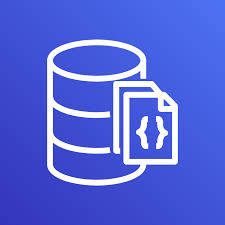
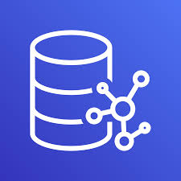
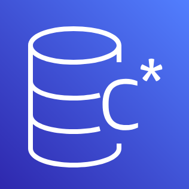
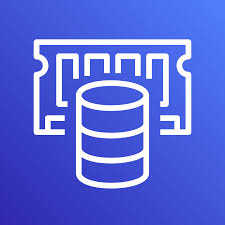

<table align="center">
    <thead>
        <tr>
            <th>Serviço</th>
            <th width="200px">Nome</th>
            <th>Descrição</th>
        </tr>
    </thead>
    <tbody>
        <tr align="center">
            <td colspan="3"><strong>Bancos de Dados SQL</strong></td>
        </tr>
        <tr align="center">
            <td>
                
            </td>
            <td>
                <a href="#aurora">Amazon Aurora</a>
            </td>
            <td>
                
Amazon Aurora é um banco de dados relacional compatível com MySQL e PostgreSQL, que combina a performance e disponibilidade de bancos de dados comerciais com a simplicidade e custo-benefício de bancos de dados de código aberto.

            </td>
        </tr>
        <tr align="center">
            <td>
                
            </td>
            <td>
                <a href="https://github.com/EdnaldoLuiz/aws-learning/blob/main/aws-services/database/sql/RDS.md">Amazon RDS</a>
            </td>
            <td>
                
Amazon RDS (Relational Database Service) facilita a configuração, operação e escalabilidade de bancos de dados relacionais na nuvem, oferecendo suporte para MySQL, PostgreSQL, MariaDB, Oracle e SQL Server.

            </td>
        </tr>
        <tr align="center">
            <td colspan="3"><strong>Bancos de Dados NoSQL</strong></td>
        </tr>
        <tr align="center">
            <td>
                
            </td>
            <td>
                <a href="#dynamodb">Amazon DynamoDB</a>
            </td>
            <td>
                
Amazon DynamoDB é um banco de dados NoSQL totalmente gerenciado, que oferece desempenho em escala, com suporte a modelos de dados de chave-valor e documentos.

            </td>
        </tr>
        <tr align="center">
            <td>
                
            </td>
            <td>
                <a href="#documentdb">Amazon DocumentDB</a>
            </td>
            <td>
                
Amazon DocumentDB é um serviço de banco de dados de documentos compatível com MongoDB, projetado para escalar e gerenciar cargas de trabalho de banco de dados de documentos de grande volume.

            </td>
        </tr>
        <tr align="center">
            <td>
                
            </td>
            <td>
                <a href="#neptune">Amazon Neptune</a>
            </td>
            <td>
                
Amazon Neptune é um serviço de banco de dados de gráficos rápido e confiável, projetado para consultar relacionamentos altamente conectados entre conjuntos de dados.

            </td>
        </tr>
        <tr align="center">
            <td>
                
            </td>
            <td>
                <a href="#keyspaces">Amazon Keyspaces</a>
            </td>
            <td>
                
Amazon Keyspaces é um serviço de banco de dados de chave-valor totalmente gerenciado, compatível com Apache Cassandra, que oferece desempenho em escala e alta disponibilidade.

            </td>
        </tr>
        <tr align="center">
            <td colspan="3"><strong>Bancos de Dados em Memória</strong></td>
        </tr>
        <tr align="center">
            <td>
                
            </td>
            <td>
                <a href="#elasticache">Amazon ElastiCache</a>
            </td>
            <td>
                
Amazon ElastiCache é um serviço de cache na memória, totalmente gerenciado, compatível com Redis e Memcached, que melhora o desempenho de aplicativos em tempo real.

            </td>
        </tr>
        <tr align="center">
            <td>
                
            </td>
            <td>
                <a href="#memorydb">Amazon MemoryDB</a>
            </td>
            <td>
                
Amazon MemoryDB é um banco de dados de memória compatível com Redis, totalmente gerenciado, que oferece persistência e alta disponibilidade para cargas de trabalho de baixa latência.

            </td>
        </tr>
        <tr align="center">
            <td colspan="3"><strong>Outros</strong></td>
        </tr>
        <tr align="center">
            <td>
                
            </td>
            <td>
                <a href="#dms">Amazon DMS</a>
            </td>
            <td>
                
O AWS Database Migration Service é um serviço de migração de banco de dados relacionais e não relacionais para a AWS de modo rápido e seguro.

            </td>
        </tr>
    </tbody>
</table>
