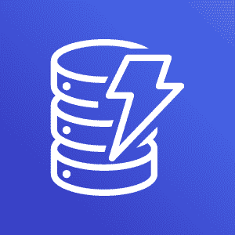
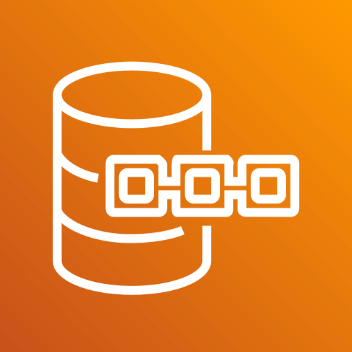

<table align="center">
<thead>
  <tr>
    <th>
Serviço
</th>
    <th width="180px">
Nome
</th>
    <th>
Modelo / Descrição
</th>
    <th>
Quando usar
</th>
    <th>
Destaques
</th>
  </tr>
</thead>
  <tbody>
    <tr align="center"><td colspan="5"><strong>Bancos de Dados SQL (Relacionais)</strong></td></tr>
    <tr align="center">
      <td></td>
      <td><a href="#aurora">Amazon Aurora</a></td>
      <td><em>Relacional compatível com MySQL/PostgreSQL.</em> Armazenamento distribuído multi-AZ, alta performance e disponibilidade.</td>
      <td>OLTP crítico com autoscaling e failover rápido.</td>
      <td>Aurora Serverless v2 (ACUs), read replicas, Global Database, backups automáticos.</td>
    </tr>
    <tr align="center">
      <td></td>
      <td><a href="https://github.com/EdnaldoLuiz/aws-learning/blob/main/aws-services/database/sql/RDS.md">Amazon RDS</a></td>
      <td><em>Relacional gerenciado.</em> Suporte a Aurora, MySQL, PostgreSQL, MariaDB, Oracle, SQL Server, Db2.</td>
      <td>Quando precisa de engine conhecida sem gerenciar SO/patch/backup.</td>
      <td>Multi-AZ, read replicas (engines suportadas), backups, criptografia, on-demand/RI.</td>
    </tr>
    <tr align="center">
      <td></td>
      <td><a href="#rds-vmware">Amazon RDS on VMware</a></td>
      <td><em>Extensão do RDS para ambientes VMware on-premises.</em> Mesma experiência do RDS na nuvem.</td>
      <td>Cenários híbridos onde não é possível migrar totalmente para AWS.</td>
      <td>Backups automáticos para AWS, patching, alta disponibilidade local, integração Console AWS.</td>
    </tr>
    <tr align="center">
      <td></td>
      <td><a href="#redshift">Amazon Redshift</a></td>
      <td><em>Data warehouse columnar (SQL/OLAP).</em> Otimizado para análises em larga escala.</td>
      <td>BI/analytics com grandes volumes de dados; integração com S3 (Spectrum).</td>
      <td>RA3/Serverless, separação compute/storage, materialized views, data sharing.</td>
    </tr>
    <tr align="center"><td colspan="5"><strong>Bancos de Dados NoSQL</strong></td></tr>
    <tr align="center">
      <td></td>
      <td><a href="#dynamodb">Amazon DynamoDB</a></td>
      <td><em>NoSQL key-value & documentos.</em> Totalmente gerenciado, baixa latência em escala.</td>
      <td>Tráfego imprevisível, escalabilidade massiva.</td>
      <td>On-demand/provisioned, GSIs/LSIs, Streams, TTL, DAX, PITR (35d), Global Tables.</td>
    </tr>
    <tr align="center">
      <td></td>
      <td><a href="#documentdb">Amazon DocumentDB</a></td>
      <td><em>Banco de documentos compatível com MongoDB API.</em></td>
      <td>Apps Mongo-like com operação gerenciada.</td>
      <td>Armazenamento distribuído, replicas, backups, alta escalabilidade.</td>
    </tr>
    <tr align="center">
      <td></td>
      <td><a href="#keyspaces">Amazon Keyspaces</a></td>
      <td><em>Compatível com Cassandra (CQL), serverless.</em></td>
      <td>Workloads Cassandra sem gerenciar clusters.</td>
      <td>Multi-AZ, cobrança por request/storage, TTL, elasticidade.</td>
    </tr>
    <tr align="center">
      <td></td>
      <td><a href="#timestream">Amazon Timestream</a></td>
      <td><em>Séries temporais.</em> Para IoT/observability com consultas time-window.</td>
      <td>Métricas, telemetria, análises temporais.</td>
      <td>Serverless, camadas quente/fria, compressão, SQL-like.</td>
    </tr>
    <tr align="center"><td colspan="5"><strong>Grafos & Ledger</strong></td></tr>
    <tr align="center">
      <td></td>
      <td><a href="#neptune">Amazon Neptune</a></td>
      <td><em>Banco de grafos gerenciado.</em> Consultas de relacionamentos altamente conectados.</td>
      <td>Recomendação, fraude, knowledge graph.</td>
      <td>Gremlin/TinkerPop, SPARQL, alta performance, replicas, backups.</td>
    </tr>
    <tr align="center">
      <td></td>
      <td><a href="#qldb">Amazon QLDB</a></td>
      <td><em>Ledger imutável com verificação criptográfica.</em></td>
      <td>Auditoria, integridade de registros.</td>
      <td>Histórico completo, SHA-256 digest, transações ACID.</td>
    </tr>
    <tr align="center"><td colspan="5"><strong>Bancos de Dados em Memória</strong></td></tr>
    <tr align="center">
      <td></td>
      <td><a href="#elasticache">Amazon ElastiCache</a></td>
      <td><em>Cache na memória (Redis/Memcached).</em></td>
      <td>Baixa latência para leitura, sessions, caching.</td>
      <td>Redis com cluster mode, failover; Memcached distribuído.</td>
    </tr>
    <tr align="center">
      <td></td>
      <td><a href="#memorydb">Amazon MemoryDB</a></td>
      <td><em>Redis compatível com persistência.</em></td>
      <td>Estado durável de baixa latência além de cache.</td>
      <td>Multi-AZ, snapshots, transações Redis, alta durabilidade.</td>
    </tr>
    <tr align="center"><td colspan="5"><strong>Outros (Migração & Replicação)</strong></td></tr>
    <tr align="center">
      <td></td>
      <td><a href="#dms">AWS DMS</a></td>
      <td><em>Migração e replicação contínua.</em></td>
      <td>Troca de engines homogênea ou heterogênea, mínima parada.</td>
      <td>CDC near-real-time, integração com SCT, alta confiabilidade.</td>
    </tr>
  </tbody>
</table>
