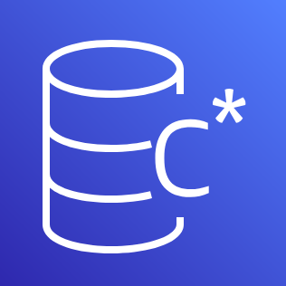

<table align="center">
    <thead>
        <tr>
            <th>Serviço</th>
            <th width=200px>Nome</th>
            <th>Descrição</th>
        </tr>
    </thead>
    <tbody>
        <tr align="center">
            <td>
                
            </td>
            <td>
                <a href="#timestream">Amazon Timestream</a>
            </td>
            <td>
                
Amazon Timestream é um banco de dados de séries temporais totalmente gerenciado, otimizado para armazenar e processar dados ao longo do tempo, facilitando a análise de tendências e padrões.

            </td>
        </tr>
        <tr align="center">
            <td>
                
            </td>
            <td>
                <a href="#aurora">Amazon Aurora</a>
            </td>
            <td>
                
Amazon Aurora é um banco de dados relacional compatível com MySQL e PostgreSQL, que combina a performance e disponibilidade de bancos de dados comerciais com a simplicidade e custo-benefício de bancos de dados de código aberto.

            </td>
        </tr>
        <tr align="center">
            <td>
                
            </td>
            <td>
                <a href="#dynamodb">Amazon DynamoDB</a>
            </td>
            <td>
                
Amazon DynamoDB é um banco de dados NoSQL totalmente gerenciado, que oferece desempenho em escala, com suporte a modelos de dados de chave-valor e documentos.

            </td>
        </tr>
        <tr align="center">
            <td>
                
            </td>
            <td>
                <a href="#redshift">Amazon Redshift</a>
            </td>
            <td>
                
Amazon Redshift é um serviço de armazenamento de dados em nuvem, otimizado para análise de grandes volumes de dados, utilizando a tecnologia de colunas para melhorar a performance de consultas.

            </td>
        </tr>
        <tr align="center">
            <td>
                
            </td>
            <td>
                <a href="#qldb">Amazon QLDB</a>
            </td>
            <td>
                
Amazon QLDB (Quantum Ledger Database) é um banco de dados de livro-razão totalmente gerenciado, que fornece um registro de transações transparente, imutável e verificável, ideal para rastrear aplicações de auditoria e histórico de dados.

            </td>
        </tr>
        <tr align="center">
            <td>
                
            </td>
            <td>
                <a href="#documentdb">Amazon DocumentDB</a>
            </td>
            <td>
                
Amazon DocumentDB é um serviço de banco de dados de documentos compatível com MongoDB, projetado para escalar e gerenciar cargas de trabalho de banco de dados de documentos de grande volume.

            </td>
        </tr>
        <tr align="center">
            <td>
                
            </td>
            <td>
                <a href="#neptune">Amazon Neptune</a>
            </td>
            <td>
                
Amazon Neptune é um serviço de banco de dados de gráficos rápido e confiável, projetado para consultar relacionamentos altamente conectados entre conjuntos de dados.

            </td>
        </tr>
        <tr align="center">
            <td>
                
            </td>
            <td>
                <a href="#keyspaces">Amazon Keyspaces</a>
            </td>
            <td>
                
Amazon Keyspaces é um serviço de banco de dados de chave-valor totalmente gerenciado, compatível com Apache Cassandra, que oferece desempenho em escala e alta disponibilidade.

            </td>
        </tr>
        <tr align="center">
            <td>
                
            </td>
            <td>
                <a href="#rds">Amazon RDS</a>
            </td>
            <td>
                
Amazon RDS (Relational Database Service) facilita a configuração, operação e escalabilidade de bancos de dados relacionais na nuvem, oferecendo suporte para MySQL, PostgreSQL, MariaDB, Oracle e SQL Server.

            </td>
        </tr>
        <tr align="center">
            <td>
                
            </td>
            <td>
                <a href="#elasticache">Amazon ElastiCache</a>
            </td>
            <td>
                
Amazon ElastiCache é um serviço de cache na memória, totalmente gerenciado, compatível com Redis e Memcached, que melhora o desempenho de aplicativos em tempo real.

            </td>
        </tr>
        <tr align="center">
            <td>
                
            </td>
            <td>
                <a href="#memorydb">Amazon MemoryDB</a>
            </td>
            <td>
                
Amazon MemoryDB é um banco de dados de memória compatível com Redis, totalmente gerenciado, que oferece persistência e alta disponibilidade para cargas de trabalho de baixa latência.

            </td>
        </tr>
    </tbody>
</table>
