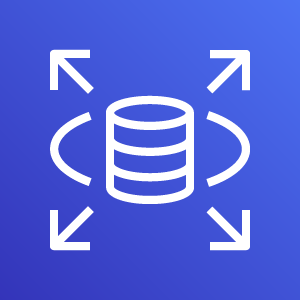

<h1 align=center> Amazon Relational Database Service (RDS) </h1>

    

---

## O que é? 

O Amazon Relational Database Service (Amazon RDS) é um serviço gerenciado da AWS que facilita a configuração, operação e escalonamento de bancos de dados relacionais na nuvem. 

Ele oferece suporte a vários motores de banco de dados populares, como **MySQL**, **PostgreSQL**, **MariaDB**, **Oracle** e **Microsoft SQL Server**, além do próprio **Aurora** da Amazon. 

O RDS elimina tarefas administrativas de banco de dados, como provisionamento de hardware, patching de software, backup e recuperação. Ele permite que os usuários se concentrem no design e na otimização de suas aplicações ao invés de gerenciar a infraestrutura do banco de dados, melhorando a eficiência e reduzindo os custos.

---

## Compatibilidade

Amazon RDS suporta os seguintes motores de banco de dados:
- MySQL
- PostgreSQL
- MariaDB
- Oracle Database
- Microsoft SQL Server
- Amazon Aurora (uma implementação compatível com MySQL e PostgreSQL)

---

## Alta Disponibilidade e Durabilidade

### Multi-AZ Deployments 

O RDS pode ser configurado para executar em múltiplas Zonas de Disponibilidade, proporcionando failover automático para a instância secundária sem intervenção manual no caso de falha.

Um dos principais recursos do Amazon RDS é configurar uma instância de banco de dados com alta disponibilidade usando uma implantação multi-AZ. 

Essa configuração gera automaticamente uma cópia em espera da instância de banco de dados em outra zona de disponibilidade na mesma Virtual Private Cloud (VPC). 

Após a cópia completa inicial, as transações são replicadas de forma síncrona para a cópia em espera. A execução de um banco de dados em várias zonas de disponibilidade pode aumentar a disponibilidade durante a manutenção planejada do sistema. 

Isso ajuda a evitar falhas no seu banco de dados e interrupções nas zonas de disponibilidade.

---

## Amazon RDS Proxy

O **Amazon RDS Proxy** é um **proxy de banco de dados totalmente gerenciado** que atua como intermediário entre as aplicações e a instância do RDS.

### Principais Benefícios

- **Alta disponibilidade**: mantém conexões abertas e as redireciona automaticamente durante failovers de Multi-AZ, reduzindo significativamente o tempo de interrupção percebido pelas aplicações.
- **Gerenciamento de conexões**: pooling eficiente, reduzindo overhead de abrir/fechar conexões de forma frequente (muito útil em apps serverless como **AWS Lambda**).
- **Segurança**: integra-se com **AWS Secrets Manager** e **IAM Authentication**, eliminando a necessidade de armazenar credenciais fixas em código.
- **Escalabilidade**: absorve picos de tráfego sem sobrecarregar diretamente o banco.

### Casos de Uso

- Aplicações críticas que sofrem **timeouts durante failover** de Multi-AZ.
- Aplicações serverless (ex.: **Lambda**) que abrem milhares de conexões simultâneas.
- Ambientes que exigem **rotação de credenciais segura e automática**.

---

## Pontos Chaves

- O Amazon RDS é um serviço de banco de dados que facilita a configuração, a operação e o dimensionamento de um banco de dados relacional na nuvem.
- Como um serviço gerenciado, o Amazon RDS pode ser acessado pelo console, pela AWS CLI ou por chamadas de interface de programação de aplicativo (API).
- O Amazon RDS oferece recursos para redundância e backups automatizados.
- O Amazon RDS é compatível com uma variedade de mecanismos de banco de dados, como Amazon Aurora, PostgreSQL, MySQL, MariaDB, Oracle Database e Microsoft SQL Server.
- O **Amazon RDS Proxy** é recomendado em cenários de **alta disponibilidade, failover rápido, uso intensivo de conexões e segurança avançada com IAM/Secrets Manager**.

